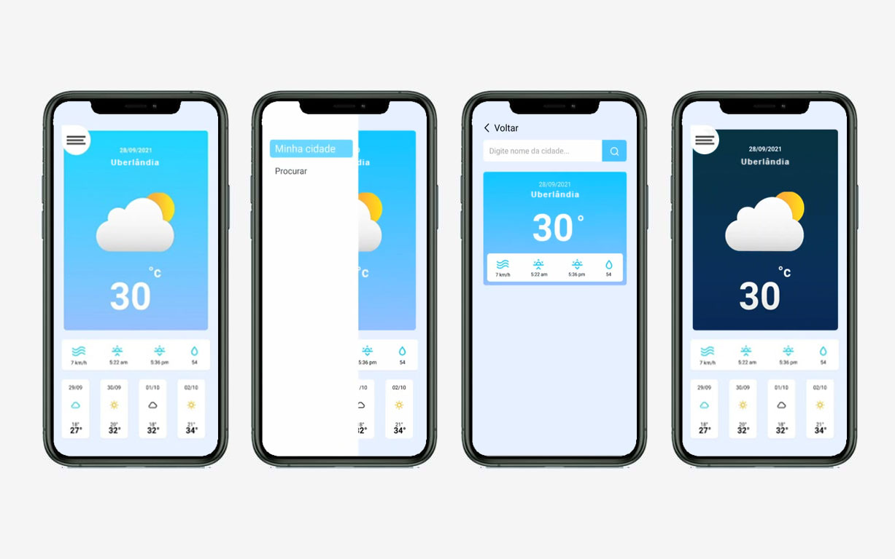

# Previsão do tempo

  

Um aplicativo de previsão do tempo. Através da localização do usuário, o app identifica a cidade em que ele se encontra e mostra a previsão do tempo dela. Além disso o usuário pode realizar a busca por determinadas cidades e ver a previsão do tempo delas.

### Técnologias utilizadas:

* React Native 
* Expo

### O que foi aprendido:

Como consumir dados de uma API externa.